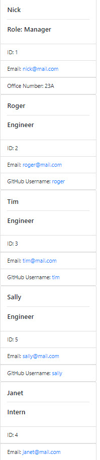

# Team Profile Generator

This program allows the user to use a command line interface to create and generate a work team.  Each member of the team is a child class of the Employee class.  Once the team is created, a webpage will be generated with cards for each member of the team.

## Technologies Used

- HTML
- Bootstrap
- CSS
- JavaScript
- Node.js
- [Inquirer](https://www.npmjs.com/package/inquirer)

## Classes Used

The first class is an Employee parent class with the following properties and methods:

- name
- id
- email
- getName()
- getId()
- getEmail()
- getRole() // Returns 'Employee'

The other three classes extend Employee.

In addition to Employee's properties and methods, Manager also has:

- officeNumber
- getRole() // Overridden to return 'Manager'

In addition to Employee's properties and methods, Engineer also has:

- github // GitHub username
- getGithub()
- getRole() // Overridden to return 'Engineer'

In addition to Employee's properties and methods, Intern also has:

- school
- getSchool()
- getRole() // Overridden to return 'Intern'

## Screenshot

